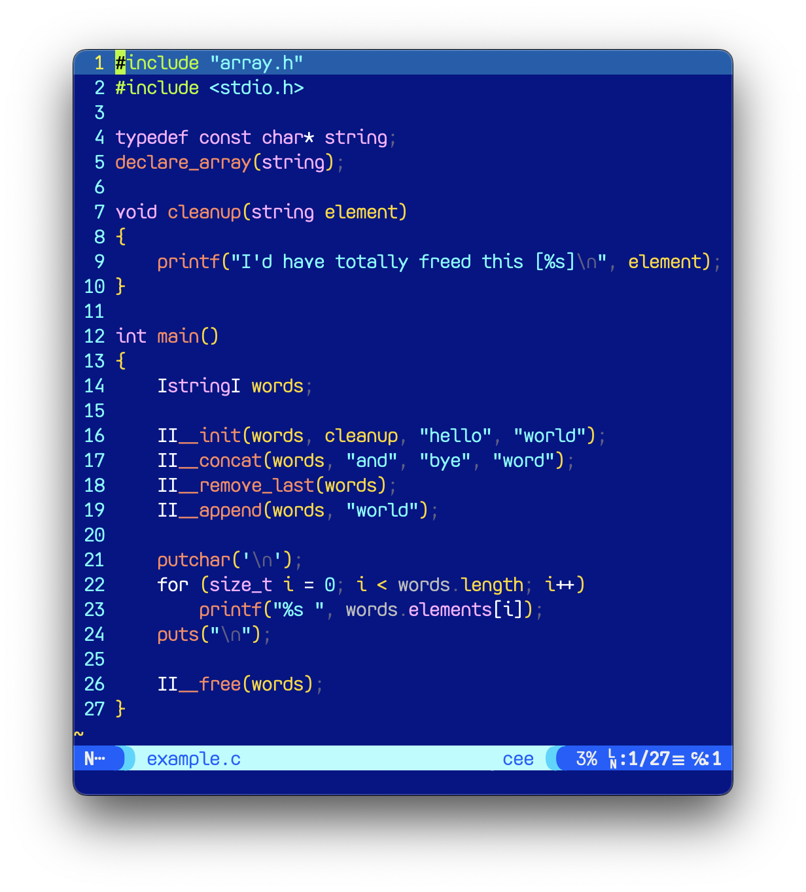

# array.h

a lightweight dynamic (and generic) `array` type C is missing.

# OVERVIEW
This is not a linked list but a dynamic array. Meaning that their elements are just next to each other.  
Although removing element in the middle is expensive for this type, every time its capacity hits the limit, `realloc` occurs for the two times of the last capacity,  

so tasks such as keep adding items, overwriting, removing the last element, slicing... are pretty cheap.

# USAGE

```
I'd have totally freed this [word]

hello world and bye world

I'd have totally freed this [world]
I'd have totally freed this [bye]
I'd have totally freed this [and]
I'd have totally freed this [world]
I'd have totally freed this [hello]
```
---
Being a smart ass, I decided that `declare_array(typename)` macro to declare `ItypenameI` struct type that totally looks like `[typename]`.  

1) use `declare_array(typename)` globally to make array type of `typename`.
1) declare a `ItypenameI` variable.
1) use `II__init(variable, elementwise_cleanup, ...)` to initialize an array.
1) profit.

---
If you don't like two underscores *(you have every right to be angry about it, but I have my own reasons)*, or the naming itself, please do change it, instead of swallowing it.

# ADVANCED
Use this with [`defer.h`](https://github.com/eastriverlee/defer.h) to make the world better place,  where the sun is shining, lollipops are singing, rainbows are giggling... and arrays are freeing themselves.
